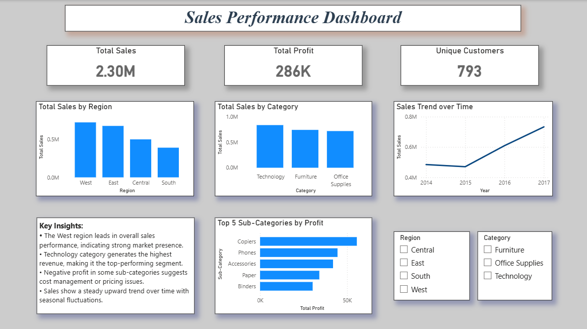

# 📊 Sales Performance Dashboard

## 📌 Overview
This project presents a Sales Performance Dashboard built using Power BI to analyze business performance across regions, categories, and time.

The dashboard provides actionable insights into sales, profit, and customer trends, enabling better decision-making.

---

## 🎯 Objectives
- Analyze overall sales and profit performance
- Identify high-performing regions and categories
- Track sales trends over time
- Provide interactive filtering for better analysis

---

## 🛠 Tools & Technologies
- Power BI
- Power Query (Data Cleaning & Transformation)
- DAX (Data Analysis Expressions)

---

## 📂 Dataset
- Superstore Sales Dataset
- Contains information on:
  - Orders
  - Sales
  - Profit
  - Regions
  - Categories

---

## 📊 Dashboard Features

### 🔝 KPI Cards
- Total Sales
- Total Profit
- Total Orders
- Profit Margin

---

### 📈 Visualizations
- Sales by Region
- Sales by Category
- Sales Trend Over Time
- Profit Analysis

---

### 🎛 Interactivity
- Slicers for Region and Category
- Dynamic filtering across visuals

---

## 🔍 Key Insights
- Certain regions contribute significantly to overall sales
- Technology category shows strong performance
- Some categories generate high sales but low profit
- Sales show variation across different time periods

---

## 📸 Dashboard Preview
 

---

## 🚀 Learnings
- Built interactive dashboards using Power BI
- Used DAX for KPI calculations
- Applied data cleaning techniques using Power Query
- Improved data visualization and storytelling skills

---

## 📬 Conclusion
This project demonstrates the ability to analyze business data and present insights through effective visualizations, making it valuable for decision-making.
