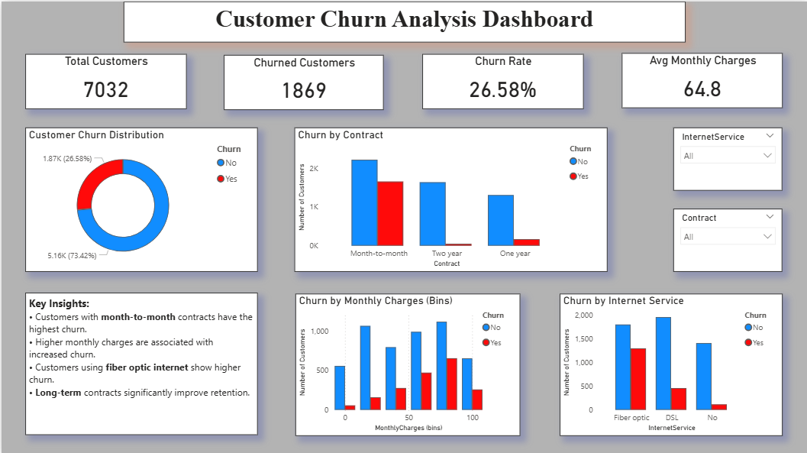

# 👥 Customer Churn Analysis Dashboard

## 📌 Overview
This project presents a Customer Churn Analysis Dashboard built using Power BI to understand customer behavior and identify factors contributing to churn.

The dashboard helps in analyzing customer retention and provides insights to reduce churn.

---

## 🎯 Objectives
- Analyze customer churn patterns
- Identify factors influencing churn
- Compare churn across different customer segments
- Provide actionable insights for retention strategies

---

## 🛠 Tools & Technologies
- Power BI
- Power Query (Data Cleaning & Transformation)
- DAX (Data Analysis Expressions)

---

## 📂 Dataset
- Customer Churn Dataset
- Includes:
  - Customer demographics
  - Subscription details
  - Monthly charges
  - Contract types
  - Churn status

---

## 📊 Dashboard Features

### 🔝 KPI Cards
- Total Customers
- Churned Customers
- Churn Rate
- Average Monthly Charges

---

### 📈 Visualizations
- Churn Distribution (Donut Chart)
- Churn by Contract Type
- Churn by Internet Service
- Churn by Monthly Charges (Binned)

---

### 🎛 Interactivity
- Filters for Contract Type and Internet Service
- Dynamic visual updates based on selection

---

## 🔍 Key Insights
- Month-to-month contract customers have the highest churn
- Higher monthly charges are associated with increased churn
- Fiber optic users show relatively higher churn
- Long-term contracts improve customer retention

---

## 📸 Dashboard Preview

---

## 🚀 Learnings
- Applied data preprocessing techniques using Power Query
- Created DAX measures for KPI analysis
- Used binning to analyze continuous data
- Developed interactive and user-friendly dashboards

---

## 📬 Conclusion
This project highlights the ability to analyze customer behavior and derive insights that can help businesses improve retention and reduce churn.
